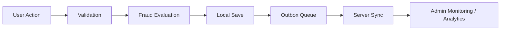

# Methodology / Working

## Step-by-Step Working of the System
1. User enters the customer or bank portal.
2. Authentication and trust checks run.
3. Customer submits a transaction.
4. Input is validated.
5. Fraud engine computes score, level, reasons, and intervention.
6. Transaction is encrypted and stored locally.
7. An outbox row is created for later sync unless the transaction is blocked.
8. Alerts, notifications, audit entries, and change logs are recorded.
9. Sync later pushes the data to the central API.
10. Admin portal reflects the resulting operational state.

## Algorithms / Logic Used
### Rule-Based Fraud Scoring
The fraud engine checks conditions such as:
- new device
- high amount
- amount above user average
- odd hour
- unusual time
- rapid burst activity
- repeated authentication failures

### Behavior Profiling
The system tracks:
- transaction count
- total amount
- average amount
- preferred hours
- rolling user risk score

### Retry and Sync Logic
The sync engine uses:
- outbox states
- retry counts
- next retry timestamps
- idempotency keys

## Data Flow Diagram

## Data Flow Explanation
The project is intentionally local-first. A transaction does not begin by calling the server. Instead, the local device handles fraud checks and secure storage first. Synchronization happens later, which is what makes the system appropriate for rural connectivity conditions.

## Navigation
- Previous: [[Technologies-Used]]
- Next: [[Implementation]]
