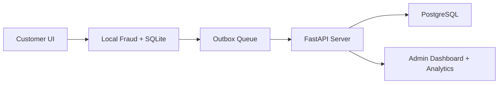

# Project Cheat Sheet

## One-Line Explanation
RuralShield is an offline-first banking security system that stores transactions locally, scores fraud locally, syncs later, and gives bank staff visibility through analytics and review tools.

## 30-Second Explanation
The system is built for rural banking conditions where internet can fail. Instead of depending on the server for every action, RuralShield writes transactions locally into SQLite, runs fraud rules locally, stores encrypted records, and pushes them to a central FastAPI + PostgreSQL backend later. The customer portal focuses on safety and usability, while the bank/admin portal focuses on monitoring, sync control, and explainable fraud analytics.

## Core Stack
| Layer | Technology |
|---|---|
| UI | FastAPI + Jinja |
| Local DB | SQLite |
| Central DB | PostgreSQL |
| Local Fraud | Rule-based engine |
| Auth | PIN + JWT + device trust + prototype face check |
| Deployment | Docker + Render |

## Main Roles
| Role | What it does |
|---|---|
| Customer | login, send money, view history, set safety controls |
| Bank/Admin | monitor, review, sync, analyze, freeze/unfreeze |
| Agent | assisted onboarding + assisted transaction flow |

## Main Databases
| Database | Purpose |
|---|---|
| SQLite | local operational continuity |
| PostgreSQL | central server state and live deployment |

## Fraud Inputs
- new device
- new recipient
- high amount
- amount vs average
- odd time
- unusual time
- rapid burst
- repeated auth failures

## Local Transaction Statuses You Should Remember
- `PENDING`
- `HOLD_FOR_REVIEW`
- `AWAITING_TRUSTED_APPROVAL`
- `BLOCKED_LOCAL`
- `SYNCED`
- `REJECTED_INTEGRITY_FAIL`

## Sync States You Should Remember
- `PENDING`
- `RETRYING`
- `SYNCED`
- `SYNCED_DUPLICATE_ACK`
- `HOLD`
- `BLOCKED`

## Best Demo Order
1. open main page
2. show bank dashboard
3. show analytics
4. show sync queue
5. show customer dashboard
6. create transaction
7. show history/detail

## Best Pages for Viva
- [[Home]]
- [[System-Architecture]]
- [[Technologies-Used]]
- [[Methodology]]
- [[Implementation]]
- [[Project-Cheat-Sheet]]
- [[Fraud-Detection-System]]
- [[Security-Layers]]

## Mini Architecture Diagram

