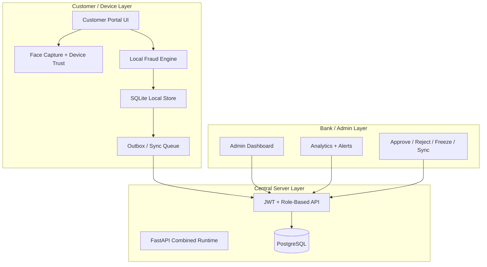

# System Architecture

## Architecture Diagram

## Explanation of Architecture
RuralShield uses a hybrid architecture. Customer operations begin locally, where fraud evaluation, encryption, and persistence happen first. This local-first model protects continuity under weak connectivity. Later, a sync mechanism pushes pending records to the central FastAPI server and PostgreSQL database. The bank/admin side can then inspect, review, and analyze those records.

## Modules / Components Description
### Customer Layer
- registration and login
- send money flow
- transaction history
- safety settings
- offline visibility

### Local Security Layer
- SQLite database
- local auth and lockout tracking
- face-hash support
- device trust handling
- fraud scoring
- transaction encryption/signing
- outbox queue

### Server Layer
- JWT auth
- central transaction APIs
- sync ingestion
- fraud/trust services
- PostgreSQL persistence

### Bank/Admin Layer
- monitoring dashboard
- analytics page
- sync queue tools
- held transaction review
- exports and reports

## Navigation
- Previous: [[Literature-Survey]]
- Next: [[Technologies-Used]]
