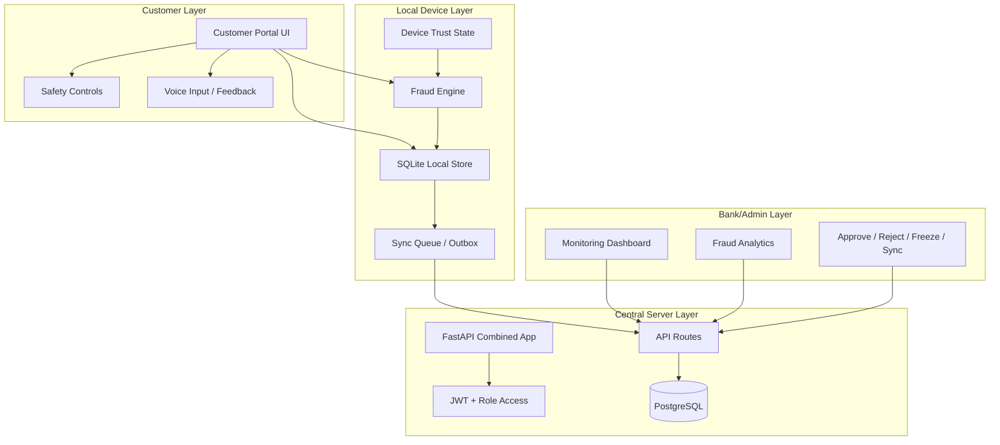

# System-Architecture

## Architecture Diagram

## Explanation of Architecture
RuralShield uses a layered architecture so that customer actions, local persistence, fraud evaluation, synchronization, and bank/admin control remain clearly separated. This makes the system easier to reason about and better suited to low-connectivity environments.

### Customer Layer
Handles user-facing actions such as viewing balance, creating transactions, checking history, and using safety features.

### Local Device Layer
This is the offline-first layer. It stores transaction state locally and allows fraud evaluation before synchronization.

### Server Layer
This is the central authority layer. It stores synchronized data and serves admin operations and analytics.

### Admin Layer
This layer gives bank/admin users visibility into risky behavior, held transactions, suspicious patterns, and device state.

## Modules / Components Description
- Authentication module
- Fraud engine
- Local storage module
- Sync queue module
- Device trust module
- Analytics module
- Customer UI module
- Admin UI module

## Extra: Data Flow Deep Dive
1. User creates a transaction.
2. Input is validated.
3. Fraud engine evaluates risk.
4. Transaction is saved locally.
5. Sync queue tracks pending state.
6. Server receives synchronized data later.
7. Admin portal reflects the result and allows review actions.

## Extra: Security Layers
- Authentication and access control
- Local persistence protection
- Fraud analysis layer
- Sync/retry handling layer
- Admin review and intervention layer

## Extra: Failure Handling
- weak internet -> local save
- risky event -> hold/block
- sync failure -> retry and queue
- suspicious user -> admin visibility and control

## Navigation
- Previous: [[Literature-Survey]]
- Next: [[Technologies-Used]]
