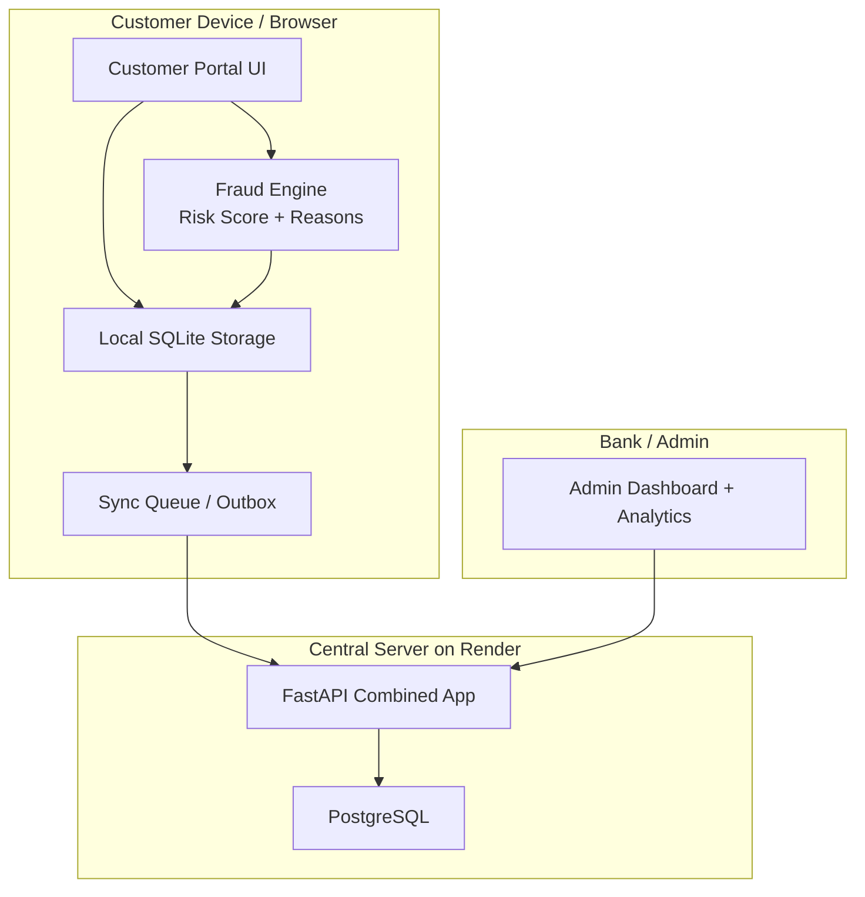

# System Architecture

## Architecture Overview
RuralShield is designed as a layered, offline-capable web system with both device-side and server-side responsibility. The architecture intentionally separates local operations from central authority so that the system remains usable under poor connectivity while still allowing the bank to maintain a final record of synchronized activity.

## High-Level Architecture Diagram

## Explanation of Architecture
### Customer-side layer
The customer-side layer is responsible for collecting transaction input, applying local validation, computing fraud risk, and writing data to local storage. This keeps the experience functional even if the server is unreachable.

### Fraud layer
The fraud engine sits close to the transaction flow. It evaluates transaction amount, device context, timing, and behavioral deviation. This is necessary because waiting for a server response would defeat the offline-first objective.

### Synchronization layer
The outbox queue stores local records that are waiting to be uploaded. It tracks sync state, retry state, timestamps, and errors. This gives the system resilience under poor connectivity.

### Server-side layer
The central FastAPI application exposes APIs for authentication, transaction handling, fraud-related data retrieval, and admin operations. PostgreSQL acts as the authoritative central store once records are synced.

### Bank/Admin layer
The admin portal provides operational oversight. Instead of being only a display layer, it enables active control: approving held transactions, releasing selected sync records, freezing risky users, and reviewing alert patterns.

## Modules / Components Description
- **Authentication module**: PIN/JWT flow, role handling, and demo face-capture support.
- **Fraud engine**: rule scoring, behavioral deviation detection, explainable outputs.
- **Local database module**: stores users, transactions, sync queue, and safety state.
- **Sync engine**: handles pending, retrying, synced, and held transitions.
- **Admin analytics module**: aggregates fraud trends, top reasons, high-risk users, and device monitoring.
- **UI layer**: customer and admin experiences, with multilingual support.

## Why This Architecture Works for Rural Banking
This architecture minimizes network dependence while preserving central oversight. That is exactly the balance needed in rural banking: the user must not be blocked by poor connectivity, but the bank must still remain the final authority for synchronized data and risk review.
