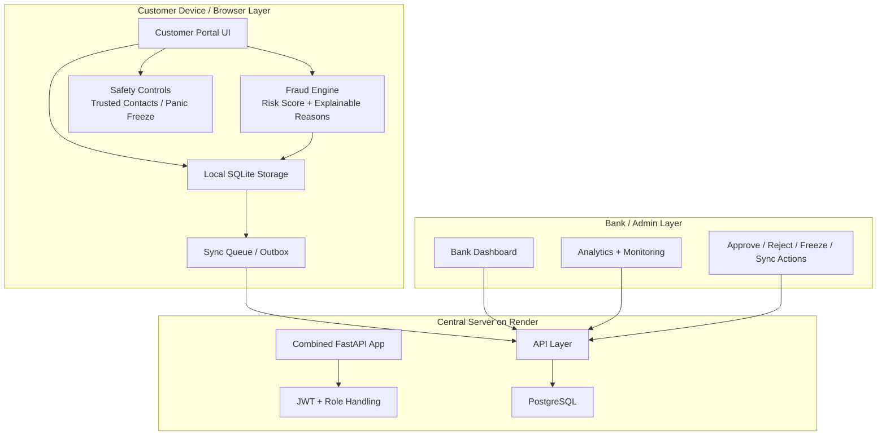

# System Architecture

## Architecture Overview
RuralShield uses a layered full-stack architecture that separates customer interaction, local persistence, fraud analysis, synchronization, and central monitoring. This separation is intentional. It allows the system to remain functional when offline, while also preserving the bank’s role as the final central authority once synchronization occurs.

## High-Level Architecture Diagram

## Explanation of the Architecture
### 1. Customer Interaction Layer
This layer provides the visible interface to the user. It includes account overview, transaction creation, alerts, transaction history, safety settings, and voice-assisted interaction. The goal is to keep the UI understandable, low-friction, and responsive even when the backend is not immediately reachable.

### 2. Local Storage Layer
The project uses SQLite locally to preserve important user and transaction data. This is central to the offline-first design. Instead of losing user intent when the internet is unavailable, the system records transaction state locally and allows later synchronization.

### 3. Fraud Engine Layer
The fraud engine runs close to the transaction creation flow. It evaluates risk using static rules and behavior-aware comparisons. Its output is not just a numerical score; it also includes reason codes and decision state, making it suitable for both automation and review.

### 4. Safety Controls Layer
Customer-side safety features such as panic freeze, trusted contacts, and risk transparency sit alongside transaction creation. These are important because rural security is not only about detecting fraud but also about giving the user confidence and recovery options.

### 5. Synchronization Layer
The synchronization layer is responsible for turning local-first operation into central consistency. The outbox queue preserves pending records, tracks retries, and supports selective sync and recovery workflows.

### 6. Server and API Layer
The deployed server is implemented using a combined FastAPI application. It exposes backend APIs, role-aware logic, and mounted routes for deployed access. This gives the system a single public deployment while preserving modular separation in the codebase.

### 7. Central Database Layer
PostgreSQL serves as the server-side persistent store. It is used for the central representation of users, transactions, fraud logs, devices, and administrative operations.

### 8. Admin and Analytics Layer
The bank/admin layer is where the project becomes operational rather than merely transactional. It includes monitoring dashboards, analytics pages, fraud trends, high-risk user lists, device monitoring, sync control, and release workflows.

## Core Components
- **Authentication module**: session, JWT, role-aware behavior
- **Fraud module**: scoring, reasons, behavior profiling
- **Storage module**: SQLite + Postgres coordination
- **Sync module**: pending, retrying, synced, held, blocked transitions
- **Analytics module**: charts, summaries, risk groupings, alerts
- **UI module**: multilingual templates, navigation, action buttons, feedback states

## Architectural Strengths
- Handles unreliable internet without losing the workflow
- Keeps fraud explainable and reviewable
- Gives both customer and admin sides meaningful capabilities
- Scales conceptually from prototype to stronger production architecture
