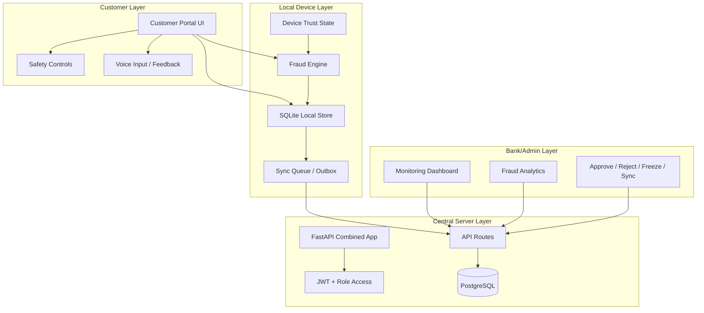

# System Architecture

## Architecture Overview
RuralShield uses a layered architecture that separates customer interaction, local state management, fraud evaluation, synchronization, central persistence, and bank/admin visibility. This structure was chosen so that the system can continue working even when the network is unavailable, while still preserving a strong central review model once synchronization occurs.

## Architecture Diagram

## Explanation of the Architecture
### Customer Layer
This is the visible product layer. It includes the customer dashboard, send money flow, history, alerts, and safety features. Its goal is to keep the experience simple and confidence-building.

### Local Device Layer
This layer is central to the project’s rural-first design.
- **SQLite** stores local-first data.
- **Fraud Engine** computes risk before sync.
- **Outbox Queue** tracks pending synchronization.
- **Device Trust State** adds contextual signals into risk evaluation.

### Server Layer
The server is the authoritative central backend. It is built as a combined FastAPI deployment and exposes authenticated APIs for transactions, review actions, analytics, and data retrieval.

### Admin Layer
The admin side provides monitoring, analytics, release controls, freeze/unfreeze operations, device visibility, and suspicious pattern handling.

## Modules / Components Description
- **Authentication module**: session management, JWT, role-based routing
- **Fraud module**: scoring logic, behavioral comparison, reason generation
- **Storage module**: local and central persistence handling
- **Sync module**: pending, retrying, synced, held, blocked states
- **Safety module**: trusted contacts, panic freeze, device trust
- **Analytics module**: charts, summaries, fraud trends, risk distribution
- **UI module**: customer and admin templates with multilingual controls

## Data Flow Deep Dive
### Customer transaction path
1. User initiates a transaction.
2. Input is validated.
3. Fraud engine computes score, decision, and reasons.
4. Record is stored locally.
5. Sync queue receives the item.
6. When conditions allow, the record is pushed to the server.
7. Server stores it in PostgreSQL.
8. Admin dashboards and analytics reflect the synchronized state.

### Admin review path
1. Admin opens dashboard or analytics.
2. Data is fetched from server or prepared from available state.
3. Held transactions are reviewed.
4. Admin action updates transaction/user state.
5. Result is reflected across the monitoring views.

## Security Layers
- authentication layer
- local persistence layer
- fraud analysis layer
- synchronization integrity layer
- admin review and control layer

## Failure Handling Strategy
- local save prevents data loss on weak networks
- queue state prevents disappearing transactions
- retry tracking provides controlled recovery
- admin release/review flow prevents irreversible mistakes

## Comparison with Real Banking Systems
Real banking systems often centralize nearly all decision-making at the backend. RuralShield differs by pushing some trust-preserving logic closer to the user while still maintaining bank-side authority. This makes it more suitable for connectivity-constrained environments.

## Navigation
- Previous: [[Literature-Survey]]
- Next: [[Technologies-Used]]
