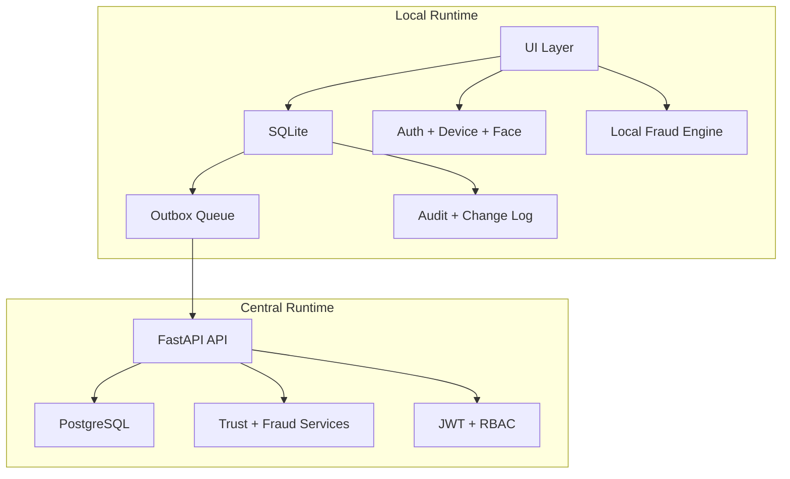

# Architecture Explanation

## Architectural Summary

RuralShield uses a layered architecture with a local operational layer and a central API layer. The local layer is responsible for continuity and immediate fraud decisions. The central layer is responsible for shared server state, JWT-backed APIs, and deployment.

## Main Layers

### Frontend / UI Layer
- FastAPI route handlers in `src/ui/app.py`
- Jinja templates in `src/ui/templates/`
- static CSS/JS in `src/ui/static/`

### Local Data Layer
- SQLite database in `data/ruralshield.db`
- schema initialization in `src/database/init_db.py`

### Local Security Layer
- local auth in `src/auth/service.py`
- biometric helper in `src/auth/biometric.py`
- cryptographic helpers in `src/crypto/service.py`

### Fraud Layer
- local rule engine in `src/fraud/engine.py`
- server-side trust-aware fraud logic in `src/server/services/fraud.py`

### Sync Layer
- local outbox sync logic in `src/sync/manager.py`
- server-side sync ingestion in `src/server/routers/sync.py`

### Central API Layer
- FastAPI app in `src/server/app.py`
- SQLAlchemy models for PostgreSQL-backed persistence

### Deployment Layer
- combined Render app in `src/deploy/app.py`
- Docker-based deployment setup

## Mermaid Architecture Diagram

## Deployment Shape

### Local Deployment
- Docker Compose runs local DB + UI + API
- UI and API can also run directly in development mode

### Render Deployment
- one combined app
- UI mounted at `/`
- API mounted at `/api`
- API docs available at `/api/docs`
- health available at `/api/health`
