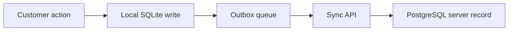

# Database Design

## Local SQLite Tables

Local tables include:

- `users`
- `accounts`
- `transactions`
- `outbox`
- `fraud_rules`
- `audit_log`
- `change_log`
- `scenario_runs`
- `user_profiles`
- `devices`
- `alerts`
- `notifications`

## Purpose of Local Tables

- `users`: auth, identity, titles, failed attempts, auth config
- `transactions`: encrypted local ledger + risk and approval metadata
- `outbox`: pending synchronization queue
- `user_profiles`: adaptive behavior statistics
- `devices`: trust tracking
- `alerts` and `notifications`: system visibility and user guidance
- `audit_log` and `change_log`: integrity and traceability

## Central PostgreSQL Models

- `User`
- `Transaction`
- `Device`
- `FraudLog`
- `SyncQueue`
- `SyncLog`
- `LegacySyncInbox`

## Data Movement

## Architectural Reason

The dual-database design exists because local continuity and central observability are both required by the project’s rural banking use case.
