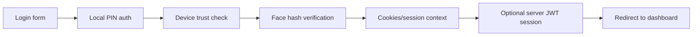
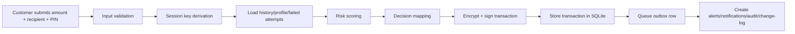
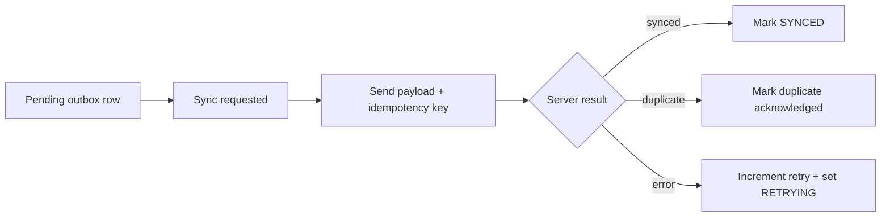

# Detailed Data Flow

## Login Flow

### Customer Login Sequence
- user enters ID and PIN
- face image is captured
- local auth checks PIN and lockout state
- device is enrolled or validated
- face hash is verified
- cookies are issued for role, user, face trust, and device trust
- server JWT session is attempted if central server is up
- dashboard loads with local and optional server-backed data

## Transaction Creation Flow

## Sync Flow

## Admin Review Flow

- admin opens dashboard or analytics transaction view
- held transaction is identified
- admin approves or rejects
- local transaction status changes
- outbox state changes accordingly
- notifications and/or alerts may be created

## Trusted Approval Release Flow

- customer transaction is stored as awaiting trusted approval
- approval code hash and expiry are stored
- release endpoint checks PIN, status, expiry, attempts, and code hash
- if correct, transaction is re-signed and returned to pending sync state
