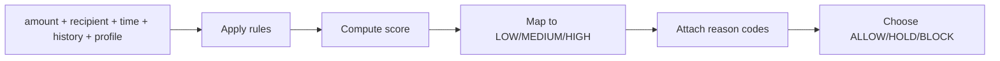

# Fraud Detection System

## Overview

RuralShield implements a rule-based, explainable fraud engine locally and a trust-aware dynamic scoring service on the server side.

## Local Fraud Rules

Implemented in `src/fraud/engine.py`:

- `HIGH_AMOUNT`
- `HIGH_AMOUNT_VS_AVG`
- `NEW_RECIPIENT`
- `ODD_HOUR`
- `UNUSUAL_TIME`
- `RAPID_BURST`
- `FIVE_IN_2_MIN`
- `AUTH_FAILURES`

## Local Score Thresholds

- score < 40 -> LOW
- score 40–69 -> MEDIUM
- score >= 70 -> HIGH

## Local Decision Logic

`decide_intervention()` maps score and reasons into:

- `ALLOW`
- `STEP_UP`
- `HOLD`
- `BLOCK`

The final persisted local status may become:

- `PENDING`
- `HOLD_FOR_REVIEW`
- `AWAITING_TRUSTED_APPROVAL`
- one of several `BLOCKED_*` states

## Example Pipeline

## Server-Side Fraud Logic

Implemented in `src/server/services/fraud.py`:

- new recipient penalty
- amount vs baseline penalty
- absolute high amount penalty
- 24-hour transaction burst penalty
- new device penalty
- trust score discount or penalty

## Explainability

Reasons are explicitly stored and shown back to users/admins in friendly form, for example:

- high amount
- new recipient
- odd hour
- unusual time
- rapid burst
- authentication failures
- new device
