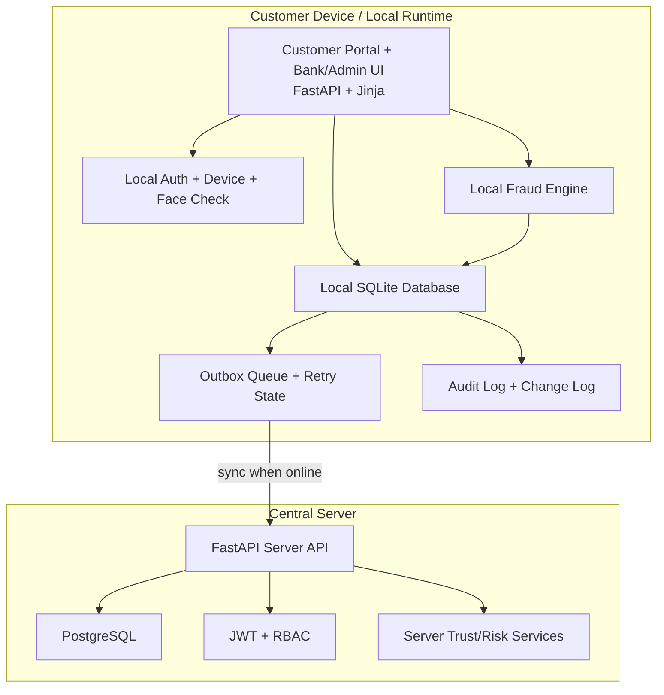
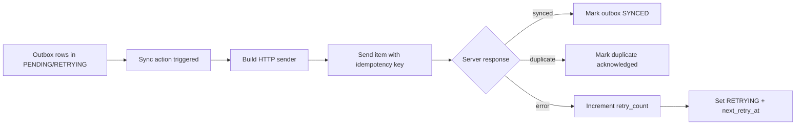
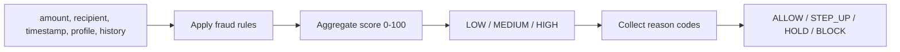
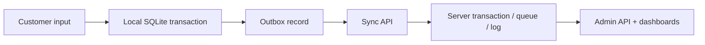

# RuralShield Complete System Explanation

## 1. System Overview

RuralShield is an offline-first rural digital banking security system built as a combined customer-facing and bank-facing web application. The project is designed around a practical rural fintech constraint: transactions and security decisions must still work when internet quality is poor, devices are low-end, and users need clearer safety guidance than a typical banking app provides.

The core idea is not just "digital banking," but **secure digital banking under unreliable connectivity**. Instead of assuming every action can be checked against a central server in real time, RuralShield performs important work locally first:

- user onboarding and PIN-based identity are stored in a local SQLite database
- transaction requests are evaluated locally by a rule-based fraud engine
- encrypted transaction records are stored locally first
- pending records are queued into a local sync outbox
- records are later synchronized to a central FastAPI + PostgreSQL server when connectivity is available

This makes the system a hybrid of:

- a **local secure operations layer** for offline continuity
- a **central server layer** for role-based access, API-driven dashboards, and long-term aggregation
- a **UI layer** for customer, bank/admin, and agent-style workflows

### High-Level Components

- **Customer Portal**: customer login, registration, send money, transaction history, safety settings, notifications, voice-assisted commands, device trust visibility, and offline status.
- **Bank/Admin Portal**: transaction monitoring, fraud analytics, risk summaries, high-risk user controls, sync queue operations, report export, data reset/import, demo tooling, and audit visibility.
- **Agent/Kiosk Flow**: assisted workflow to create a user and initiate a transaction from one screen.
- **Local Security Layer**: local auth service, biometric hash support, encryption, transaction signing, audit chain, change log, and monitoring tables.
- **Fraud Layer**: adaptive local risk scoring, explainable reason generation, intervention decisioning, profile tracking, and alerts.
- **Sync Layer**: outbox queue, retry scheduling, one-record sync, selected-record sync, full sync, duplicate protection, and server-side sync ingestion.
- **Central Server API**: JWT-based API with PostgreSQL storage, RBAC, server-side risk/trust scoring, sync processing, and admin endpoints.
- **Deployment Layer**: combined Render app that mounts UI at `/` and API at `/api`, with Docker-based deployment support.

---

## 2. Complete Feature List

This section lists all implemented features, including visible UI behavior and hidden system behavior.

### Customer Features

- Customer registration with:
  - user ID
  - phone number
  - 4-digit PIN
  - title, first name, last name
  - required face capture
  - device enrollment
- Customer login with:
  - PIN authentication
  - face capture check
  - device trust check
  - server JWT session creation when server is available
- Human-friendly customer identity display:
  - title + first name + last name + customer ID
- Customer dashboard with:
  - demo balance calculation
  - total transactions
  - pending sync count
  - held count
  - last activity indicator
  - risk badge
  - mini statement
  - notifications
  - alerts summary
  - sync status
  - behavior profile summary
- Send Money flow:
  - PIN-protected submission
  - recipient validation
  - amount validation
  - local fraud scoring
  - allow / hold / block decision
  - local encrypted persistence
  - outbox queue insertion unless blocked
  - user-facing explanations
- Voice-assisted send flow:
  - typed natural-language command parsing
  - browser speech recognition integration in UI
  - AJAX endpoint for voice transaction creation
- Transaction history:
  - PIN unlock
  - decrypted amount and recipient
  - integrity verification
  - decision details
  - risk score and reasons
  - transaction detail view per transaction
- Safety settings:
  - set trusted contact
  - remove trusted contact
  - panic freeze for configurable minutes
- Device trust indicator:
  - trusted vs untrusted device in session context
- Offline mode simulator:
  - cookie-based offline toggle in UI
- Voice feedback support:
  - generated voice text for transaction result or prompts
- Customer notifications:
  - transaction queued/success
  - held transaction warning
  - blocked transaction warning
- Customer alerts panel:
  - new device warning
  - pending sync warning
  - held transaction warning
  - all clear state

### Bank/Admin Features

- Admin/bank login page with face capture requirement in UI
- Bank dashboard with sections for:
  - monitoring
  - operations
  - administration
  - tools
- Local monitoring overview:
  - user count
  - transaction count
  - allowed count
  - held count
  - blocked count
  - pending sync count
- Local fraud intelligence:
  - fraud trends by day
  - risk distribution summary
  - top fraud reasons
  - high-risk users list
  - suspicious alerts list
  - device monitoring list
  - bank notifications list
- Transaction monitoring:
  - list all
  - list held
  - list blocked
  - list allowed
  - show amount, recipient, decision, reasons, status
- Review flows:
  - approve/reject local held transactions
  - review server-side held transactions through API
- User-level control:
  - freeze user
  - unfreeze user
- Analytics page:
  - separate dedicated analytics screen
  - user-wise comparison
  - single-user deep dive
  - risk distribution visualization
  - fraud trends visualization
  - top fraud reasons
  - alerts/device intelligence
- Sync Queue page:
  - view outbox rows
  - sync all pending
  - sync one row
  - sync selected rows
  - simulate night sync
  - release held rows where applicable
- Data/export tools:
  - export security report JSON
  - export change log CSV
  - audit integrity check page
  - impact report page
- Database utilities:
  - import local SQLite DB into deployed instance
  - reset local SQLite DB with backup
- Demo tooling:
  - one-click demo run
  - demo result page
  - seed demo data
  - professor walkthrough page
  - scenario simulation support
- Agent mode:
  - assisted onboarding + transaction in one screen

### Hidden/System Features

- Local PIN hashing via scrypt with random salt
- Phone hashing via SHA-256
- Face template hashing using lightweight perceptual image hashing
- Device enrollment and trust persistence
- Lockout handling for repeated failed PIN attempts
- Alert creation on repeated failed logins
- Notification creation for risky events
- Local transaction encryption using AES-GCM
- Local transaction signature using HMAC
- Integrity-failure rejection in history reads
- Outbox idempotency key generation
- Retry scheduling with exponential backoff
- Audit hash chain append + verification
- Structured field-level change logging
- User behavior profiling and EWMA-style user risk score update
- Friendly i18n translation bundle system used across UI pages
- Flash message cookies for cross-redirect UX feedback
- Friendly HTML error page fallback with JSON error fallback for API-like requests
- Render combined deployment app mounting UI and API together
- Database schema backfill/migration-lite helpers for older local DBs

---

## 3. Architecture Explanation

RuralShield uses a layered architecture where the UI, local data layer, fraud layer, sync layer, and central server are all distinct but connected.

### Architectural Layers

- **Frontend/UI Layer**
  - Implemented with FastAPI route handlers and Jinja templates
  - Main controller file: `src/ui/app.py`
  - Templates in `src/ui/templates/`
  - Static assets in `src/ui/static/`
- **Local Data & Security Layer**
  - Local SQLite database in `data/ruralshield.db`
  - Schema initialization in `src/database/init_db.py`
  - Auth, transaction storage, device store, monitoring store, profile store
- **Fraud & Decision Layer**
  - Local fraud scoring in `src/fraud/engine.py`
  - Local intervention decisions: allow / hold / step-up / block
  - Server-side dynamic trust-aware fraud scoring in `src/server/services/fraud.py`
- **Sync Layer**
  - Outbox queue stored locally
  - Sync manager in `src/sync/manager.py`
  - HTTP sender/client support in `src/sync/client.py`
  - Server-side sync ingestion routes in `src/server/routers/sync.py`
- **Central Server Layer**
  - FastAPI app in `src/server/app.py`
  - SQLAlchemy models for PostgreSQL-backed central records
  - JWT and RBAC enforcement
- **Deployment Layer**
  - Combined app in `src/deploy/app.py`
  - Dockerfile, docker-compose, render.yaml

### Mermaid Architecture Diagram

### Frontend Design

The frontend is not a SPA. It is a server-rendered web system using Jinja templates, but it also includes targeted JavaScript on some pages for:

- AJAX transaction creation
- speech recognition
- language switching persistence
- smoother demo interactions

This hybrid model keeps the frontend lightweight and avoids the need for a separate React/Vue build process.

### Local Database Usage

SQLite is the operational source of truth for offline/local flows. It stores:

- users
- encrypted transactions
- outbox queue
- audit logs
- monitoring alerts and notifications
- devices
- user profiles

### Central Database Usage

PostgreSQL is the server-side shared state used by the JWT-backed API. It stores:

- server users and roles
- server transactions
- fraud logs
- sync queue/log state
- devices
- legacy sync inbox entries

### Deployment Structure

Locally:
- UI and API may run separately
- docker-compose provisions DB + API + UI for dev/demo

On Render:
- one combined app is used
- UI is mounted at `/`
- API is mounted at `/api`
- live docs are at `/api/docs`
- live health is at `/api/health`

---

## 4. Detailed Data Flow

This section explains how major workflows move through the system.

### 4.1 Login Flow

#### Customer Login

1. Customer opens `/customer/login`
2. UI captures:
   - user ID
   - PIN
   - face image
   - device ID
3. `authenticate_user()` validates local PIN and lockout state
4. `enroll_or_verify_device_id()` checks or enrolls the current device
5. `enroll_or_verify_face_hash()` compares captured face hash to stored template
6. If device is trusted and face slightly drifts, `refresh_face_hash_on_trusted_device()` may refresh the stored hash instead of blocking the demo
7. UI sets cookies:
   - role
   - user ID
   - face_verified flag
   - device trust status
8. UI attempts to mint a central server JWT session as well
9. Customer is redirected to `/dashboard/customer`

#### Bank Login

1. Admin opens `/bank/login`
2. UI captures admin username, password, and face image
3. Credentials are checked against configured default bank constants
4. Captured bank face hash is stored for prototype traceability, but login is not hard-blocked on strict face hash matching
5. Bank role cookie and optional JWT are set
6. User is redirected to `/bank/dashboard`

### 4.2 Transaction Creation Flow (Customer Local Flow)

```mermaid
flowchart LR
    A["Customer enters PIN, amount, recipient"] --> B["Validate input"]
    B --> C["Derive session key from PIN"]
    C --> D["Load local history + failed attempts + profile"]
    D --> E["Score transaction in local fraud engine"]
    E --> F["Decide ALLOW / HOLD / BLOCK"]
    F --> G["Encrypt amount + recipient"]
    G --> H["Sign transaction"]
    H --> I["Store in transactions table"]
    I --> J["Queue outbox row unless blocked"]
    J --> K["Create notifications/alerts/audit/change-log"]
    K --> L["Return details to UI"]
```

Step-by-step:

1. UI validates recipient and amount before sending request.
2. Backend derives session key using the customer PIN.
3. From the session key, separate encryption and signature keys are derived.
4. Local history, failed login count, and behavior profile are loaded.
5. Fraud score and reason codes are calculated.
6. Intervention decision is made.
7. Panic freeze, trusted contact rules, and device-based forced hold can override status.
8. Amount and recipient are AES-GCM encrypted.
9. Canonical signable transaction payload is HMAC-signed.
10. Transaction row is inserted into SQLite.
11. Outbox row is created unless the transaction is blocked.
12. User profile is updated.
13. Notifications, alerts, audit entries, and change-log entries are written.
14. UI gets decision summary and links to detail/history.

### 4.3 Transaction Storage Flow

- Local storage uses encrypted amount/recipient, not plaintext.
- Change log separately stores human-readable `amount` and `recipient` values for demo/report visibility.
- This means the system has both:
  - secure operational storage
  - explicit demo/report reconstruction support

### 4.4 Sync Flow

Sync can happen through:

- `POST /sync` for all pending rows
- `POST /sync/one` for one specific outbox item
- `POST /sync/selected` for a selected set of outbox items
- `POST /sync/simulate` for local demo-only forced sync state change

### 4.5 Admin Review Flow

1. Bank/Admin sees held transactions in dashboard or analytics-linked views.
2. A held transaction can be:
   - approved -> local status becomes `PENDING`, sync state `PENDING`
   - rejected -> local status becomes `BLOCKED_MANUAL_REJECT`, sync state `BLOCKED`
3. Optional alerts/notifications are created.
4. Admin API routes expose the same behavior for AJAX/API use.

### 4.6 Trusted Approval Release Flow

For transactions requiring trusted contact approval:

1. Transaction is stored as `AWAITING_TRUSTED_APPROVAL`
2. Approval hash, expiry, attempts, and masked hint are stored
3. Release endpoint validates:
   - correct user PIN
   - transaction status is releasable
   - approval not expired
   - max attempts not exceeded
   - approval code hash matches
4. If valid:
   - status becomes `PENDING`
   - signature is re-signed with new status
   - outbox returns to `PENDING`
5. Audit and change log are recorded

---

## 5. Fraud Detection System (Detailed)

RuralShield has **two fraud layers**:

- a **local/offline fraud engine** in `src/fraud/engine.py`
- a **server trust-aware fraud service** in `src/server/services/fraud.py`

The customer-facing local flow uses the local engine most heavily. The server layer supports central sync/API-backed decisioning.

### 5.1 Local Rule-Based Fraud Logic

Implemented local rules:

- **HIGH_AMOUNT**: amount >= 3000 -> +35
- **HIGH_AMOUNT_VS_AVG**: amount >= 2.5 × user average (only when enough history exists) -> +25
- **NEW_RECIPIENT**: recipient not in recent history -> +20
- **ODD_HOUR**: transaction at late-night/odd hours -> +15
- **UNUSUAL_TIME**: time outside preferred usage hours when enough behavior history exists -> +10
- **RAPID_BURST**: >= 3 recent transactions in 10 minutes -> +20
- **FIVE_IN_2_MIN**: >= 5 transactions in 2 minutes -> +25
- **AUTH_FAILURES**: >= 3 recent failed PIN attempts -> +20

### 5.2 Risk Level Thresholds

- `LOW`: score < 40
- `MEDIUM`: 40 to 69
- `HIGH`: >= 70

### 5.3 Local Decision Thresholds

After scoring, `decide_intervention()` maps score + reasons to action:

- `BLOCK`
  - high score with authentication failures
- `HOLD`
  - `HIGH_AMOUNT` + `NEW_RECIPIENT`
  - or any `HIGH` risk outcome
- `STEP_UP`
  - `MEDIUM` risk
- `ALLOW`
  - otherwise

The local UI workflow ultimately expresses this through transaction statuses like:

- `PENDING`
- `HOLD_FOR_REVIEW`
- `AWAITING_TRUSTED_APPROVAL`
- `BLOCKED_LOCAL`
- `BLOCKED_PANIC_FREEZE`
- `BLOCKED_MANUAL_REJECT`
- `BLOCKED_TRUST_CHECK_FAILED`
- `BLOCKED_APPROVAL_EXPIRED`
- `SYNCED`
- `REJECTED_INTEGRITY_FAIL`

### 5.4 Local Example Pipeline

Example:

- amount: 5200
- recipient: new
- time: odd hour
- profile average: 900

Possible reasons:
- HIGH_AMOUNT
- HIGH_AMOUNT_VS_AVG
- NEW_RECIPIENT
- ODD_HOUR

Result:
- high score
- decision: HOLD
- UI shows simple friendly explanation

### 5.5 Server-Side Risk Logic

The server fraud service uses:

- new recipient
- amount vs baseline
- absolute high amount
- 24h transaction count
- new/untrusted device
- trust score adjustments from device/sync reliability

This is more trust-aware and server-oriented than the local engine.

### 5.6 Reason Generation

The project explicitly stores and surfaces explainable codes such as:

- `HIGH_AMOUNT`
- `HIGH_AMOUNT_VS_AVG`
- `NEW_RECIPIENT`
- `ODD_HOUR`
- `UNUSUAL_TIME`
- `RAPID_BURST`
- `FIVE_IN_2_MIN`
- `AUTH_FAILURES`
- `NEW_DEVICE`
- `FACE_WEAK`

These are converted into friendlier labels in the UI through helper functions like `_friendly_reason()`.

---

## 6. Behavior Profiling

Behavior profiling is implemented locally in `src/database/profile_store.py` and is also used conceptually by the server layer.

### What the System Tracks Per User

The `user_profiles` table stores:

- `tx_count`
- `total_amount`
- `avg_amount`
- `last_tx_at`
- `hour_hist`
- `user_risk_score`

### How Averages Are Computed

When a new transaction is created:

- `tx_count` increases
- `total_amount` increases by transaction amount
- `avg_amount = total_amount / tx_count`

### How Preferred Time Is Computed

- `hour_hist` is a JSON histogram of transaction hour -> count
- `preferred_hours(profile, top_n=3)` extracts the most-used hours
- local fraud scoring uses this to detect unusual usage time when enough history exists

### How User Risk Score Is Computed

`user_risk_score` is updated using an EWMA-like formula:

- first transaction -> user risk = tx risk
- later -> `0.7 * previous_user_risk + 0.3 * current_tx_risk`

This makes the profile adaptive without overreacting to a single transaction.

### How Anomalies Are Detected

Anomaly logic includes:

- amount much larger than average
- transaction outside preferred hours
- new recipient compared with history
- rapid bursts compared with recent behavior

Admin analytics later aggregate this into:

- high-risk user list
- late-night count
- risk bucket counts
- peak usage hours

---

## 7. Offline-First System

The offline-first layer is one of the most important parts of RuralShield.

### SQLite Usage

SQLite acts as the local operational ledger. It stores:

- identity and auth state
- encrypted transaction data
- pending sync records
- alerts and notifications
- audit logs and change logs
- devices and profiles

This allows the product to remain usable even if the central server is unavailable.

### Outbox Queue

The `outbox` table stores pending records that need to be pushed to the server. Each outbox row includes fields such as:

- `outbox_id`
- `tx_id`
- `payload_enc`
- `sync_state`
- `retry_count`
- `next_retry_at`
- `idempotency_key`
- `last_error`

### Sync States

Observed sync states include:

- `PENDING`
- `RETRYING`
- `SYNCED`
- `SYNCED_DUPLICATE_ACK`
- `HOLD`
- `BLOCKED`

### Retry Mechanism

The sync manager:

- selects due rows in `PENDING` or `RETRYING`
- sends each item with idempotency key
- marks success or duplicate acknowledgements
- on error:
  - increments `retry_count`
  - stores `last_error`
  - computes `next_retry_at`
  - sets state to `RETRYING`

The backoff is exponential and capped.

### Sync Entry Points

Local admin can:

- sync all pending
- sync one specific record
- sync a selected set of rows
- simulate night sync locally without server

### Why This Matters

This architecture lets the app behave like a rural-ready operational system rather than a typical always-online demo.

---

## 8. Customer Portal (Full Detail)

### 8.1 Customer Registration

What it does:
- creates a new local user
- stores identity metadata
- enrolls face hash
- enrolls device
- attempts to register/login into the server API too

How it works internally:
- `create_user()` writes user record with hashed phone/PIN and auth config
- `_store_face_capture()` stores a PNG in `data/face_captures`
- `_face_hash_from_capture_path()` generates dhash64
- `enroll_or_verify_face_hash()` stores the template
- `enroll_or_verify_device_id()` stores device in auth config and devices table

### 8.2 Customer Login

What it does:
- authenticates locally
- checks face and device
- creates UI session cookies
- tries to create server JWT session

Important internal logic:
- failed attempts and lockout are enforced locally
- face mismatch on trusted device can be softened through refresh logic
- new device marks device trust as untrusted

### 8.3 Dashboard

What it shows:
- balance (demo value)
- transaction counters
- held/pending indicators
- recent transaction meta
- notifications
- last sync time
- current trusted contact/freeze state
- user risk summary
- preferred hours and average amount

How it works:
- `_customer_dashboard_context()` assembles all customer UI data
- pulls stats from local SQLite
- computes demo balance as `50000 - total_amount`
- loads profile and notifications
- creates alerts list based on held, pending, device trust

### 8.4 Send Money

What it does:
- lets a customer create a transaction with full local fraud processing

APIs/Routes used:
- form post: `/customer/transactions`
- AJAX JSON route: `/customer/api/transactions`
- server-side alternative: `/customer/server/transactions`

Internal behavior:
- validates PIN, amount, recipient
- adds extra risk when device untrusted or face weak
- may force hold on new device
- returns detailed decision in JSON mode

### 8.5 Voice Send

What it does:
- accepts commands like “Send 500 to Ramesh”

How it works:
- browser speech recognition captures text in frontend
- `_parse_voice_command()` extracts amount + recipient
- `/customer/api/voice` reuses the same local transaction pipeline
- returns parsed values + decision result

### 8.6 Transaction History

What it does:
- decrypts and displays customer transaction list

How it works internally:
- requires PIN again
- `list_secure_transactions()` derives keys and verifies signatures
- decrypts amount and recipient only when integrity check passes
- if tampered, transaction is shown as `REJECTED_INTEGRITY_FAIL`

### 8.7 Transaction Detail Page

What it does:
- shows one transaction’s full explanation and guidance

How it works:
- local transaction is read and formatted into human-friendly risk, status, and reasons
- guidance is extracted from intervention data

### 8.8 Safety Settings

Trusted Contacts:
- `set_trusted_contact()` stores trusted contact in auth config
- `remove_trusted_contact()` removes it
- trusted contact can reduce friction conceptually and can be required for release workflows

Panic Freeze:
- `enable_panic_freeze()` sets `freeze_until`
- future outgoing transactions can be blocked locally while freeze is active

### 8.9 Offline Mode

What it does:
- toggles customer UI into an offline simulation state via cookie

Why it exists:
- lets demo flows explicitly show offline-first behavior

### 8.10 Notifications and Alerts

Notifications are stored in local SQLite and shown in customer dashboard.
They include:

- transaction success/queued
- held transaction notice
- blocked/suspicious activity notice

Alerts section is built server-side so the template stays simple and the text is translated consistently.

---

## 9. Admin Portal (Full Detail)

### 9.1 Admin Dashboard

Purpose:
- operational home for bank staff

Sections:
- Monitoring
- Operations
- Administration
- Tools

The dashboard intentionally mixes immediate operations with analytics shortcuts.

### 9.2 Monitoring

Includes:
- admin overview cards
- local transaction monitoring
- view filters for all/held/blocked/allowed
- server connectivity summary when JWT-backed server is available

### 9.3 Analytics

The analytics page is designed to separate monitoring from “insight” content.

Includes:
- overview cards
- risk distribution
- top fraud reasons
- fraud trends table/graph data
- high-risk users
- alerts list
- devices list
- notifications list
- user-wise comparative analytics
- single-user deep dive

### 9.4 Single-User Analytics

The `_single_user_insights()` helper computes:

- failed attempts
- last auth time
- trusted contact
- freeze until
- risk bucket counts
- late-night transaction count
- held count
- blocked count
- top reasons
- 24-hour usage bars

This makes admin analytics not just global but also user-specific.

### 9.5 Sync Queue Operations

Admin can:

- inspect current outbox rows
- see sync state, retry count, next retry, last error
- sync all pending
- sync a single row
- sync selected rows
- simulate a local night sync

This is an unusually strong demo feature because it exposes the offline-first architecture directly.

### 9.6 Held Transaction Control

Admin has two review pathways:

- local SQLite review
- central server review via API

Local decisions are immediate and update local status/outbox state.

### 9.7 User Management

Admin can:
- create local user
- replace existing local user
- inspect users list
- freeze/unfreeze users via local admin API

### 9.8 Reports and Logs

Admin can access:
- audit events page
- change log page
- security report page
- downloadable JSON report
- downloadable CSV change log
- impact report page

### 9.9 Import/Reset Tools

Import DB:
- uploads a `.db` file
- backs up current DB
- replaces DB atomically-ish
- re-initializes schema backfills if needed

Reset DB:
- creates backup
- deletes DB
- recreates blank schema

### 9.10 Demo/Professor-Oriented Utilities

- one-click demo run populates multiple users, risky flows, failed logins, bursts, and high-risk examples
- demo result page links directly into dashboard/analytics/sync/walkthrough
- scenario simulation helpers exist for guided presentations

---

## 10. Security Layers

RuralShield uses multiple security layers rather than a single check.

### 10.1 Authentication

Local authentication:
- PIN-based login
- scrypt hashing
- failed-attempt tracking
- lockout support

Server authentication:
- JWT issuance through `/auth/login`
- bearer token decoding and dependency-based user retrieval

### 10.2 Authorization

Roles implemented:
- customer
- bank / bank_officer
- agent

Enforced through:
- UI-side `_require_role()` route guard
- API-side `require_roles()` dependency

### 10.3 Encryption

Local encryption:
- AES-GCM for transaction amount and recipient
- session key derived from PIN
- enc/sig keys derived from session key

Server encryption:
- AES-GCM helper for sensitive server-side fields such as recipient text

### 10.4 Integrity Protection

- HMAC signature per local transaction
- verified when decrypting/listing history
- tampered records surface as integrity failures instead of silently decrypting

### 10.5 Device Binding / Trust

- local device enrollment in auth config
- separate `devices` table with seen count and trust state
- server-side `Device` model with trust level
- device status influences both local and server-side risk

### 10.6 Biometric Layer

- prototype face verification using perceptual image hash
- used as an extra signal, not as production-grade biometric proof
- face hash may be refreshed on trusted devices to reduce false negatives during demo use

### 10.7 Fraud Layer

- local fraud scoring before transaction persistence completes
- server-side risk/trust scoring for central API path
- reasons and decisions are explicit and stored

### 10.8 Logging and Audit

- audit hash chain for tamper-evident event history
- change log for field-level updates
- alerts/notifications for suspicious conditions
- UI error log file for route/render failures

---

## 11. Database Design

### 11.1 Local SQLite Tables

From `src/database/init_db.py`, the local DB contains:

- `users`
  - identity, hashed phone, pin hash/salt, failed attempts, auth config, title/first/last names
- `accounts`
  - account-related demo storage
- `transactions`
  - local encrypted transaction ledger
  - stores risk score, risk level, status, reason codes, intervention data, approval metadata
- `outbox`
  - pending sync queue and retry state
- `fraud_rules`
  - rule storage for minimal/legacy rules API
- `audit_log`
  - append-only audit hash chain records
- `change_log`
  - field-level modification tracking
- `scenario_runs`
  - demo/scenario support
- `user_profiles`
  - behavior profile stats and user risk score
- `devices`
  - device trust tracking and usage counts
- `alerts`
  - suspicious activity alert records
- `notifications`
  - customer/bank notification records

### 11.2 Central PostgreSQL Tables / Models

From SQLAlchemy models:

- `users`
- `transactions`
- `devices`
- `fraud_logs`
- `sync_queue`
- `sync_logs`
- `legacy_sync_inbox`

### 11.3 Data Movement

### 11.4 Why Two Databases Exist

- SQLite exists so the system can operate offline and locally.
- PostgreSQL exists so there is a central, shareable, role-based backend for deployment and bank visibility.

---

## 12. API Design

### 12.1 Central Server API

#### Auth
- `POST /auth/register`
- `POST /auth/login`
- `GET /auth/me`

Typical login response includes:
- access token
- token type
- role

#### Transactions
- `POST /transactions`
- `GET /transactions/me`
- `GET /transactions` (bank role)
- `POST /transactions/{tx_id}/review`

#### Sync
- `POST /sync/push`
- `POST /sync/push_v2`
- `GET /sync/logs`
- `GET /sync/status`

#### Fraud
- `GET /fraud/logs`

#### Agent
- `POST /agent/onboard`
- `POST /agent/assisted-transaction`

#### Legacy Compatibility
- `POST /sync/transactions`
- `GET /rules`
- `POST /rules`

### 12.2 Local/UI-Level JSON APIs

- `GET /customer/api/summary`
- `POST /customer/api/transactions`
- `POST /customer/api/voice`
- `GET /admin/api/fraud-trends`
- `GET /admin/api/high-risk-users`
- `GET /admin/api/alerts`
- `GET /admin/api/devices`
- `GET /admin/api/transactions`
- `GET /admin/api/user-profile/{user_id}`
- `POST /admin/api/transactions/{tx_id}/review`
- `POST /admin/api/users/{user_id}/freeze`
- `POST /admin/api/users/{user_id}/unfreeze`

### 12.3 UI Interaction Pattern

The UI uses a mix of:

- direct HTML form posts for classic flows
- redirect + flash cookie behavior for multi-step UX
- AJAX JSON for customer transaction creation and voice send
- server API calls using JWT when connected

### 12.4 Response Shape Conventions

UI helper responses often use:

- `_json_ok(data, message=...)`
- `_json_err(message, status_code=...)`

This gives a consistent JSON envelope for many local admin/customer API-style routes.

---

## 13. Error Handling & Validation

### Input Validation

Examples implemented:
- PIN required / PIN length checks
- amount must be > 0
- recipient must be non-empty
- invalid decisions rejected in review APIs
- invalid freeze durations rejected
- invalid role rejected on login
- invalid DB import file rejected unless `.db` and non-trivial size

### Auth Error Handling

- lockout states return friendly messages
- wrong PIN vs user-not-found is mapped to UX-specific translations
- repeated failures can create alerts/notifications

### Transaction Error Handling

- customer AJAX transaction route returns JSON error instead of redirecting to broken page
- history decrypt errors or signature failures are surfaced safely
- release-held logic safely blocks expired or over-attempted approvals

### Sync Error Handling

- retries store `last_error`
- exponential backoff is scheduled automatically
- UI sync actions preserve server URL in cookie even on failure

### UI Error Handling

The UI app has a custom exception handler that:
- logs failures to `data/ui_errors.log`
- returns JSON for JSON-like requests
- renders a friendly `error.html` page for browser users

### Fallback Logic

Examples:
- if server JWT session cannot be created, local UI still functions offline-first
- if template/translation data is missing, defaults are used
- if profile or notifications load fails, dashboard falls back to safe defaults
- if face verification fails on a trusted device, face hash refresh may reduce false blocking

---

## 14. Hidden / Internal Logic

This section highlights internal logic that may not be obvious from the main UI.

### Important Helper Logic in UI Controller

`src/ui/app.py` contains a large amount of orchestration logic beyond route definitions:

- `_customer_dashboard_context()`
  - assembles nearly all customer dashboard state
- `_admin_dashboard_context()`
  - bundles bank page context and portal titles
- `_local_admin_overview()`
  - computes local admin summary metrics
- `_fraud_trends()`
  - aggregates alerts and high-risk transactions by day
- `_high_risk_users()`
  - converts profile data into admin-facing ranking records
- `_risk_distribution()`
  - buckets profile risk scores into low/medium/high
- `_top_fraud_reasons()`
  - aggregates reasons from local transaction reason codes
- `_local_tx_amount_recipient()`
  - reconstructs readable amount/recipient from change log for admin visibility
- `_fetch_outbox_rows()` / `_outbox_stats()`
  - build sync queue page data
- `_bank_user_analytics()` / `_single_user_insights()`
  - compute user-comparison and deep-dive analytics
- `_parse_voice_command()`
  - lightweight natural-language parser for voice commands
- `_friendly_*()` helpers
  - convert raw status/risk/reasons/actions/timestamps into UX-friendly strings

### Monitoring Store Hidden Behavior

`create_alert()` and `create_notification()` are called from multiple subsystems, not just one screen. This means alerts are an internal cross-cutting concern.

### Audit + Change Log Layer

Every important state change can create:
- audit events for integrity-oriented tracking
- change log entries for readable mutation tracing

These are separate concerns and both exist simultaneously.

### Schema Backfill Logic

The local DB initialization file automatically checks for missing columns and adds them. This means the app supports upgrading older local DB files without a formal migration framework.

### Trust and Face Softening Logic

The code does not blindly hard-block every face mismatch. On trusted devices it can refresh the stored face hash to reduce operational friction during demonstrations and real low-quality-camera situations.

### Legacy Compatibility Layer

Older routes and minimal backend endpoints remain implemented so older links or earlier integration paths still work.

---

## 15. Limitations

These are real limitations based on the current code.

- Face verification is prototype-grade perceptual hashing, not production biometric verification.
- Bank login uses configured default credentials, not a full admin user management system.
- Some functionality exists in both local/UI and server/API layers, which increases complexity.
- The customer-side “balance” is a demo calculation, not a fully reconciled account ledger.
- Local change log stores readable values for demo/report visibility, which is useful operationally for explanation but weakens a pure-secrets-at-rest design if treated as production behavior.
- Recipient novelty on the server is simplified and does not use a full plaintext-safe recipient identity comparison strategy.
- Formal migrations are not implemented; instead, SQLite uses schema backfill helpers.
- Background sync is not daemonized as a separate worker process; it is user-triggered/demo-triggered through routes.
- No real payment rail integration is present.
- Notifications are stored locally but not pushed externally through SMS, email, or mobile push.

---

## 16. Future Scope

These are realistic improvements that fit the current architecture.

- Replace prototype face hash with proper biometric verification or liveness-aware second-factor flow.
- Add formal migration tooling for both SQLite and PostgreSQL.
- Introduce a background sync worker or scheduler for automatic periodic sync.
- Extend trust scoring with more signals such as geolocation consistency, SIM/device fingerprint quality, or session reputation.
- Add true multi-factor admin identity instead of fixed admin credentials.
- Add customer-facing dispute and support workflows tied to held/blocked transactions.
- Move some analytics aggregation into dedicated services for cleaner separation from UI controller logic.
- Add real push/SMS/WhatsApp notifications for rural customer safety communication.
- Add a more complete server-side account/balance model with bidirectional ledger entries.
- Improve server-side recipient novelty detection without exposing plaintext recipient data.

---

## Additional Notes

### Important Live URLs

- Main UI: [https://ruralshield.onrender.com/?lang=en](https://ruralshield.onrender.com/?lang=en)
- Customer Portal: [https://ruralshield.onrender.com/customer](https://ruralshield.onrender.com/customer)
- Bank/Admin Portal: [https://ruralshield.onrender.com/bank](https://ruralshield.onrender.com/bank)
- API Docs: [https://ruralshield.onrender.com/api/docs](https://ruralshield.onrender.com/api/docs)
- Health: [https://ruralshield.onrender.com/api/health](https://ruralshield.onrender.com/api/health)

### Main Code Entry Points

- UI controller: `/Users/bhumi/Desktop/SEM 6/PINNACLE/CyberShakti/Cybersecurity Framework for Rural Digital Banking/src/ui/app.py`
- Local auth: `/Users/bhumi/Desktop/SEM 6/PINNACLE/CyberShakti/Cybersecurity Framework for Rural Digital Banking/src/auth/service.py`
- Fraud engine: `/Users/bhumi/Desktop/SEM 6/PINNACLE/CyberShakti/Cybersecurity Framework for Rural Digital Banking/src/fraud/engine.py`
- Local transaction store: `/Users/bhumi/Desktop/SEM 6/PINNACLE/CyberShakti/Cybersecurity Framework for Rural Digital Banking/src/database/transaction_store.py`
- Sync manager: `/Users/bhumi/Desktop/SEM 6/PINNACLE/CyberShakti/Cybersecurity Framework for Rural Digital Banking/src/sync/manager.py`
- Central API app: `/Users/bhumi/Desktop/SEM 6/PINNACLE/CyberShakti/Cybersecurity Framework for Rural Digital Banking/src/server/app.py`
- Render combined app: `/Users/bhumi/Desktop/SEM 6/PINNACLE/CyberShakti/Cybersecurity Framework for Rural Digital Banking/src/deploy/app.py`

